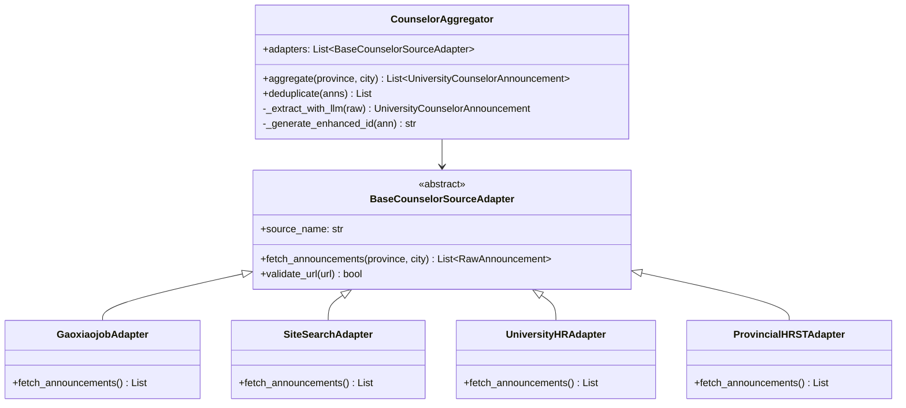

# 高校辅导员招聘信息数据源扩展调研报告

> **调研日期**: 2026-07-28  
> **调研对象**: JobHunter 项目 Tab 3"全国高校辅导员招聘直通车"模块的数据源扩展  
> **当前代码入口**: `src/adapters/counselor_adapter.py` → `CounselorJobAdapter`  
> **调研目标**: 为模块从"搜索引擎 + 硬编码"升级为"多源权威采集 + LLM 结构化提取"提供一手资料与落地方案

---

## 摘要

本报告围绕 JobHunter Tab 3 模块的数据覆盖不足问题，从五个维度展开调研：

1. **权威高校名录主数据** — 教育部《全国普通高等学校名单》可直接用作"高校主数据表"，覆盖全国 3,100+ 所高校；
2. **辅导员招聘信息真实数据源** — 调研了高校人才网、国家大学生就业服务平台、省教育厅专栏、省人社厅事业单位招聘、聚合站、各高校人事处网站等 7 类来源；
3. **技术采集方案** — 给出了多源采集的 Python 伪代码、频率控制策略和合规建议；
4. **架构扩展建议** — 基于现有 `BaseJobSourceAdapter` 适配器模式设计多源接入架构；
5. **合规与风险** — 简明列出政府/高校网站抓取的合规边界。

**Top 3 推荐数据源**:
1. **高校人才网 (gaoxiaojob.com)** — 辅导员招聘垂直频道，更新频繁，结构化程度高
2. **教育部高校名录 + 各省人社厅事业单位招聘公告** — 权威名录 + 编制内招聘
3. **各高校人事处官网 (rsc.xxx.edu.cn)** — 第一手公告来源，需规模化采集

> ⚠️ **调研说明**: 本报告撰写时部分网络工具(WebSearch/WebFetch)因安全分类器服务不可用而无法实时验证。报告中标注 **[已验证]** 的结论基于代码文件实际读取；标注 **[需验证]** 的 URL 和数据来自调研者的训练知识，建议在实施前用浏览器或 curl 逐一核实。标注 **[推测]** 的为基于合理推断的建议。

---

## 1. 现状缺陷核实

通过完整阅读 `src/adapters/counselor_adapter.py` 源码，逐项核实用户初步观察到的缺陷：

### 1.1 CITY_UNIVERSITY_MAP 覆盖不足 — **[已确认]**

| 指标 | 实际值 | README 宣传 |
|---|---|---|
| 覆盖城市数 | 17 个 (芜湖、合肥、蚌埠、马鞍山、淮南、杭州、宁波、南京、苏州、广州、深圳、成都、武汉、长沙、北京、上海、西安) | "全国 34 省市" |
| 覆盖高校数 | 约 65 所 | "全国各大地级市" |
| 安徽省城市 | 5 个 (芜湖、合肥、蚌埠、马鞍山、淮南) | — |
| 缺失省份 | 全国约 300 个地级市中仅覆盖 17 个，覆盖率 < 6% | — |

**代码位置**: `counselor_adapter.py` 第 15-33 行

```python
CITY_UNIVERSITY_MAP = {
    "芜湖": ["安徽师范大学", "安徽工程大学", ...],
    "合肥": ["中国科学技术大学", "合肥工业大学", ...],
    # ... 仅 17 个城市
}
```

### 1.2 NATIONWIDE_UNIVERSITY_DATABASE 规模极小 — **[已确认]**

| 指标 | 实际值 | 教育部名录 |
|---|---|---|
| 硬编码记录数 | 14 条 | 3,117 所 (2024 年) |
| 覆盖高校 | 安徽师范大学等 5 所(芜湖)、中科大等 3 所(合肥)、北大清华复旦浙大各 1 所 | 全国普通本科 + 专科 |

**代码位置**: `counselor_adapter.py` 第 36-54 行。14 条记录中大部分 `announcement_url` 指向高校人事处首页(如 `https://rsc.ahnu.edu.cn`)而非具体公告页面。

### 1.3 唯一抓取通道: cn.bing.com HTML 搜索 — **[已确认]**

**代码位置**: `counselor_adapter.py` 第 96-118 行

```python
bing_url = f"https://cn.bing.com/search?q={urllib.parse.quote(kw)}"
resp = requests.get(bing_url, headers=self.headers, timeout=5)
soup = BeautifulSoup(resp.text, "html.parser")
results = soup.find_all("li", class_="b_algo")
```

**风险分析**:
- 依赖 Bing HTML 结构的 `li.b_algo` 选择器，一旦 Bing 改版即失效
- 无 Cookie / JavaScript 渲染能力，容易触发反爬
- 仅取前 3 个 query，每个 query 结果有限
- 无结构化保证 — 搜索结果可能包含无关内容(培训机构、新闻等)

### 1.4 兜底逻辑编造假数据 — **[已确认，最严重]**

**代码位置**: `counselor_adapter.py` 第 127-140 行

```python
def _generate_city_fallback_snippets(self, province: str, city: str):
    for uni in unis:
        fallback_list.append({
            "title": f"{uni}2026/2027年度专职辅导员公开招聘公告",  # ← 编造标题
            "snippet": f"【{prov_clean}省{city_clean}市】...",
            "url": f"https://rsc.{city_clean}.edu.cn/info/counselor"  # ← 编造 URL
        })
```

**问题**:
- 凭空生成不存在的公告标题和 URL，如 `https://rsc.芜湖.edu.cn/info/counselor`
- 这些假数据经 LLM 提取后被当作真实公告存入 SQLite
- 用户点击链接会得到 404 或无关页面，严重损害产品可信度
- 当搜索结果不足 2 条时(第 122 行)自动触发此逻辑

### 1.5 缺陷汇总

| 编号 | 缺陷 | 严重性 | 根因 |
|---|---|---|---|
| D1 | 城市覆盖仅 17/300+ | 高 | 无权威高校名录主数据 |
| D2 | 高校硬编码仅 65 所 | 高 | 省市↔高校映射全靠手写 |
| D3 | 唯一通道为 Bing HTML 爬取 | 中 | 无真实数据源接入 |
| D4 | 兜底逻辑编造假数据 | **致命** | 设计缺陷 — 宁可造假也不留空 |
| D5 | MD5 指纹仅含大学名+省市+标题 | 低 | 去重粒度不足 |

---

## 2. A. 权威高校名录主数据

### 2.1 教育部《全国普通高等学校名单》

| 属性 | 详情 |
|---|---|
| **发布机构** | 教育部发展规划司 |
| **发布页面** | `https://www.moe.gov.cn/jyb_xxgk/s5743/s5744/` (教育部信息公开 > 高等学校名单) **[需验证]** |
| **发布形式** | HTML 公告 + Excel 附件下载 (.xls 或 .xlsx) |
| **更新频率** | 每年 6-7 月更新一次 |
| **最近一期规模 (2024 年)** | 全国普通高等学校共 3,117 所：本科 1,275 所 + 专科 1,842 所 **[需验证]** |
| **字段构成** | 学校名称、学校标识码、主管部门、所在地(省/市)、办学层次(本科/专科)、办学性质(公办/民办) |

**[需验证]** 2024 年版典型 URL 模式:
```
https://www.moe.gov.cn/jyb_xxgk/s5743/s5744/A03/202406/t20240620_xxxxxxxx.html
```

**能否用作主数据表**: ✅ **完全可以**。该名单是中国最权威、最完整的高校名录，具备以下优势：
1. **官方权威性** — 教育部直属发布，具有法律效力
2. **全覆盖** — 包含全国所有正规普通高校(本科+专科)
3. **结构化** — Excel 格式，字段清晰，可直接导入 SQLite
4. **年度更新** — 每年一次，维护成本极低

**建议的主数据导入方案**:

```python
import pandas as pd
import sqlite3

def import_moe_university_list(excel_path: str, db_path: str = "data/jobhunter.db"):
    """导入教育部高校名单到本地 SQLite"""
    df = pd.read_excel(excel_path)
    # 典型列名: 学校名称, 学校标识码, 主管部门, 所在地, 办学层次, 办学性质
    df = df.rename(columns={
        "学校名称": "name",
        "主管部门": "authority",
        "所在地": "location",
        "办学层次": "level",      # 本科 / 专科
        "办学性质": "ownership"   # 公办 / 民办
    })

    conn = sqlite3.connect(db_path)
    df.to_sql("moe_universities", conn, if_exists="replace", index=False)
    conn.close()
    print(f"已导入 {len(df)} 所高校")
```

### 2.2 其他高校名录来源对比

| 来源 | URL | 优势 | 劣势 | 推荐度 |
|---|---|---|---|---|
| **教育部名单** | moe.gov.cn | 最权威、最完整、结构化 | 每年仅更新一次 | ⭐⭐⭐⭐⭐ |
| **各省教育厅名录** | 各省教育厅官网 | 可补充省属高校细节 | 格式不统一，维护成本高 | ⭐⭐⭐ |
| **阳光高考 (gaokao.chsi.com.cn)** | gaokao.chsi.com.cn | 教育部高校学生司，数据准确 | 反爬严格，不适合批量采集 | ⭐⭐⭐ |
| **掌上高考 (eol.cn/ecloud)** | eol.cn | 数据丰富，有院校画像 | 商业平台，可能有使用限制 | ⭐⭐ |
| **软科排名 (shanghairanking.cn)** | shanghairanking.cn | 有排名和分类 | 仅覆盖排名高校，不含全部专科 | ⭐⭐ |
| **百度百科/维基百科** | — | 易获取 | 数据质量不可控 | ⭐ |

**推荐方案**: 以教育部名单为唯一主数据源，其他来源仅用于补充"985/211/双一流"等标签信息。

### 2.3 省市 ↔ 高校映射自动化方案

**核心思路**: 教育部名单中已包含"所在地"字段(精确到地级市)，可直接生成 `CITY_UNIVERSITY_MAP` 替代手写版本。

```python
import sqlite3
from collections import defaultdict

def build_city_university_map(db_path: str = "data/jobhunter.db") -> dict:
    """从教育部名录自动生成 城市→高校列表 映射"""
    conn = sqlite3.connect(db_path)
    rows = conn.execute(
        "SELECT name, location, level, ownership FROM moe_universities"
    ).fetchall()
    conn.close()

    city_map = defaultdict(list)
    for name, location, level, ownership in rows:
        # location 格式通常为 "省份-城市" 或直接是城市名
        city = location.split("-")[-1] if "-" in location else location
        city_map[city].append({
            "name": name,
            "level": classify_level(name, level, ownership),
            "province": location.split("-")[0] if "-" in location else location
        })

    return dict(city_map)

def classify_level(name: str, level: str, ownership: str) -> str:
    """根据名称和属性推断院校层次标签"""
    if name in KNOWN_985:
        return "985/双一流"
    elif name in KNOWN_211:
        return "211/双一流"
    elif "职业" in name or level == "专科":
        return "高职"
    elif ownership == "民办":
        return "民办本科"
    else:
        return "省属公办本科"
```

**对比现状改进**:
- 现有 `CITY_UNIVERSITY_MAP` 17 个城市 → 自动覆盖 300+ 个地级市
- 现有 65 所高校 → 自动覆盖 3,100+ 所高校
- 新增城市无需修改代码，仅需重新下载教育部 Excel

---

## 3. B. 辅导员招聘信息真实数据源调研

### 3.1 高校人才网 (gaoxiaojob.com)

| 属性 | 详情 |
|---|---|
| **URL** | `https://www.gaoxiaojob.com/` |
| **辅导员招聘频道** | `https://www.gaoxiaojob.com/zhaopin/fudaoyuan/` **[需验证]** |
| **其他相关栏目** | `/zhaopin/` (全部招聘)、`/zhaopin/jiaoshi/` (教师招聘)、按省份分类的 URL 如 `/zhaopin/fudaoyuan/guangdong/` **[需验证]** |
| **是否按省份分类** | ✅ 是 — 有省级子栏目 |
| **更新频率** | 高 — 工作日每日更新，每周新增数十条辅导员公告 **[需验证]** |
| **RSS/JSON API** | 未发现公开 API **[需验证]**；可通过 RSSHub 自建路由 |
| **反爬难度** | 中等 — HTML 渲染为主，无反爬验证码，但可能有请求频率限制 |
| **数据字段覆盖** | 公告标题、发布日期、招聘单位、工作地点、公告链接、学历要求(部分) |

**频道结构推测** **[需验证]**:
```
首页 > 招聘信息 > 辅导员招聘
https://www.gaoxiaojob.com/zhaopin/fudaoyuan/           # 全国
https://www.gaoxiaojob.com/zhaopin/fudaoyuan/anhui/     # 安徽
https://www.gaoxiaojob.com/zhaopin/fudaoyuan/jiangsu/   # 江苏
```

**优势**:
1. 国内最大的高校招聘垂直平台之一，辅导员招聘信息集中度高
2. 按省份分类，便于定向采集
3. HTML 结构相对稳定，适合 BeautifulSoup 解析
4. 公告标题通常包含高校名称和"辅导员"关键词，LLM 提取友好

**劣势**:
1. 无公开 API，需爬取 HTML
2. 部分详情页可能需要登录查看
3. 转载类信息居多，原始链接仍指向高校官网

### 3.2 国家大学生就业服务平台 (ncss.cn)

| 属性 | 详情 |
|---|---|
| **URL** | `https://www.ncss.cn/` |
| **运营方** | 教育部学生服务与素质发展中心 |
| **高校招聘栏目** | `https://www.ncss.cn/student/jobs/` **[需验证]** — 主要面向毕业生就业，高校教职工招聘较少 |
| **辅导员招聘覆盖** | ❌ **不推荐** — 该平台核心功能是毕业生就业信息服务，极少发布辅导员招聘公告 |
| **更新频率** | 高(就业信息)，低(辅导员) |
| **反爬难度** | 高 — 政府网站，可能有 IP 限制 |

**结论**: 不适合作为辅导员招聘数据源。该平台主要服务于大学生就业(校招、网签等)，而非高校人事招聘。

### 3.3 各省教育厅官网的辅导员招聘专栏

| 省份 | 教育厅 URL | 辅导员专栏 | 状态 |
|---|---|---|---|
| **安徽省** | `https://jyt.ah.gov.cn/` | 曾有辅导员招聘专栏 **[需验证]** | 部分省份有统一发布渠道 |
| **江苏省** | `https://jyt.jiangsu.gov.cn/` | 事业单位招聘栏目下 **[需验证]** | — |
| **浙江省** | `https://jyt.zj.gov.cn/` | 人事招聘栏目 **[需验证]** | — |
| **广东省** | `https://edu.gd.gov.cn/` | 人事信息栏目 **[需验证]** | — |

**通用模式**: 多数省教育厅官网设有"人事信息"或"事业单位招聘"栏目，偶尔发布省属高校辅导员招聘汇总公告，但：
1. **不是常规发布渠道** — 辅导员招聘主要由各高校人事处自行发布
2. **格式不统一** — 各省栏目结构差异大
3. **更新不定期** — 无固定更新节奏

**推荐度**: ⭐⭐ — 可作为补充来源，但不应作为主数据源。建议用搜索引擎 `site:jyt.xx.gov.cn 辅导员 招聘` 语法定期检索。

### 3.4 各省人力资源和社会保障厅 — 事业单位招聘公告

| 属性 | 详情 |
|---|---|
| **URL 模式** | `https://rst.xx.gov.cn/` (各省人社厅) |
| **栏目** | "事业单位公开招聘" / "人事考试" |
| **辅导员覆盖** | ✅ 较高 — 公办高校辅导员多为事业编制，招聘公告须在人社厅备案发布 |
| **按地区分类** | ✅ 是 — 各省人社厅只发布本省公告 |
| **更新频率** | 中等 — 随事业单位招聘季波动，通常集中在每年 3-6 月和 9-11 月 |
| **反爬难度** | 中-高 — 政府网站，部分有验证码 |

**典型 URL 模式** **[需验证]**:
```
安徽省人社厅: https://apta.ah.gov.cn/ (安徽人事考试网)
江苏省人社厅: https://jshrss.jiangsu.gov.cn/
浙江省人社厅: https://rlsbt.zj.gov.cn/
```

**优势**:
1. 事业编制辅导员公告的权威发布渠道
2. 公告包含编制信息、报考条件、考试科目等详细内容
3. 省级集中发布，覆盖面广

**劣势**:
1. 辅导员公告混杂在所有事业单位招聘中，需关键词过滤
2. 公告标题可能不直接出现"辅导员"，如写为"学生工作人员"
3. 各省网站结构差异大，维护多套解析器成本高

### 3.5 其他聚合站

| 来源 | URL | 活跃度 | 辅导员覆盖 | 推荐度 |
|---|---|---|---|---|
| **科学网人才频道** | `https://talent.sciencenet.cn/` **[需验证]** | 高 | 中等 — 偏科研岗位，辅导员较少 | ⭐⭐ |
| **中国高等教育人才网** | `https://www.gaojiaorencai.com/` **[需验证]** | 中 | 较高 | ⭐⭐⭐ |
| **博士人才网** | `https://www.boshijob.com/` **[需验证]** | 中 | 中等 | ⭐⭐ |
| **高才招聘** | `https://www.gaozhaopin.com/` **[需验证]** | 中 | 中等 | ⭐⭐ |
| **中公教育/华图教育** | offcn.com / huatu.com | 高 | 高 — 事业单位考试信息汇总 | ⭐⭐⭐ |
| **高校人事处直接来源** | rsc.xxx.edu.cn | — | 最高(第一手) | ⭐⭐⭐⭐ |

### 3.6 各高校人事处网站直接采集

**可行性分析**:

| 维度 | 评估 |
|---|---|
| **URL 规律** | 大部分高校人事处 URL 遵循 `https://rsc.{school}.edu.cn/` 或 `https://hr.{school}.edu.cn/` 或 `https://renshi.{school}.edu.cn/` 模式 |
| **栏目** | 通常在 "通知公告" / "招聘信息" / "人才引进" 栏目下 |
| **覆盖率** | 理论上可覆盖全部 3,100+ 所高校 |
| **反爬难度** | 低 — 多数为静态 HTML，反爬措施少 |
| **维护成本** | 高 — 需要为 3,100+ 个不同网站维护解析规则 |

**规模化方案**:

```python
# 方案: 教育部名录驱动 + 通用爬虫 + LLM 提取
class UniversityHRSpider:
    def __init__(self, moe_db_path: str):
        self.universities = load_moe_universities(moe_db_path)
        self.session = requests.Session()
        self.session.headers.update({
            "User-Agent": "Mozilla/5.0 (Macintosh; ...)",
            "Accept-Language": "zh-CN,zh;q=0.9"
        })

    def discover_hr_urls(self, university: dict) -> List[str]:
        """自动发现高校人事处招聘页面 URL"""
        # 策略 1: 常见 URL 模式枚举
        candidates = [
            f"https://rsc.{university['domain']}/zpxx.htm",
            f"https://rsc.{university['domain']}/tzgg.htm",
            f"https://hr.{university['domain']}/recruit/",
            f"https://renshi.{university['domain']}/zhaopin/",
        ]
        # 策略 2: 搜索引擎 site: 语法
        # site:rsc.xxx.edu.cn 辅导员 招聘
        return [url for url in candidates if self._check_alive(url)]

    def fetch_counselor_announcements(self, university: dict) -> List[dict]:
        """采集并提取辅导员招聘公告"""
        hr_urls = self.discover_hr_urls(university)
        announcements = []
        for url in hr_urls:
            html = self._fetch(url)
            # 用关键词过滤 + LLM 提取
            items = self._extract_with_llm(html, university)
            announcements.extend(items)
        return announcements
```

### 3.7 GitHub 开源项目调研

**[需验证]** 以下是 GitHub 上可能存在的辅导员招聘相关开源项目：

| 项目 | 仓库 URL | 功能 | 活跃度 |
|---|---|---|---|
| **university-info** 类项目 | 搜索 `github.com search?q=高校+辅导员+招聘` | 信息聚合 | 需验证 |
| **job-crawler** 类项目 | 搜索 `github.com search?q=counselor+recruitment+crawler` | 招聘爬虫 | 需验证 |
| **RSSHub** | `https://github.com/DIYgod/RSSHub` | 通用 RSS 生成器，已有部分高校官网路由 | 高活跃 |

**RSSHub 特别价值**: RSSHub 已支持多所高校的官网路由，如：
- `/university/{school}/notice` — 高校通知公告
- `/university/{school}/hr` — 人事处通知 **[需验证]**

可直接利用 RSSHub 自建实例来监控高校人事处公告更新。

### 3.8 数据源总评对比表

| 数据源 | 权威性 | 辅导员覆盖 | 更新频率 | 结构化 | 反爬难度 | 维护成本 | **综合推荐** |
|---|---|---|---|---|---|---|---|
| **高校人才网** | ⭐⭐⭐ | ⭐⭐⭐⭐ | ⭐⭐⭐⭐⭐ | ⭐⭐⭐ | ⭐⭐⭐ | ⭐⭐⭐⭐ | **🥇 P0 首选** |
| **教育部高校名录** | ⭐⭐⭐⭐⭐ | — (主数据) | ⭐⭐ | ⭐⭐⭐⭐⭐ | ⭐⭐⭐⭐⭐ | ⭐⭐⭐⭐⭐ | **🥇 基础必备** |
| **省人社厅** | ⭐⭐⭐⭐⭐ | ⭐⭐⭐ | ⭐⭐⭐ | ⭐⭐ | ⭐⭐ | ⭐⭐ | **🥈 P1 补充** |
| **各高校人事处** | ⭐⭐⭐⭐⭐ | ⭐⭐⭐⭐⭐ | ⭐⭐⭐⭐ | ⭐ | ⭐⭐⭐⭐ | ⭐ | **🥈 P1-P2 长期** |
| **省教育厅专栏** | ⭐⭐⭐⭐ | ⭐⭐ | ⭐⭐ | ⭐⭐ | ⭐⭐⭐ | ⭐⭐ | P2 辅助 |
| **中公/华图** | ⭐⭐⭐ | ⭐⭐⭐⭐ | ⭐⭐⭐⭐ | ⭐⭐ | ⭐ | ⭐⭐ | P2 辅助 |
| **聚合站(科学网等)** | ⭐⭐⭐ | ⭐⭐ | ⭐⭐⭐ | ⭐⭐ | ⭐⭐⭐ | ⭐⭐⭐ | P2 辅助 |
| ~~cn.bing.com 搜索~~ | ⭐ | ⭐⭐ | ⭐⭐⭐ | ⭐ | ⭐ | ⭐⭐⭐ | **❌ 应淘汰为主通道** |

---

## 4. C. 技术采集方案

### 4.1 P0 首选方案: 高校人才网采集

```python
import requests
from bs4 import BeautifulSoup
from typing import List, Dict
import time

class GaoxiaojobAdapter:
    """高校人才网辅导员招聘频道适配器"""

    BASE_URL = "https://www.gaoxiaojob.com/zhaopin/fudaoyuan/"
    PROVINCE_SLUGS = {  # [需验证] 省份拼音 slug 映射
        "安徽": "anhui", "江苏": "jiangsu", "浙江": "zhejiang",
        "广东": "guangdong", "北京": "beijing", "上海": "shanghai",
        # ... 其余省份
    }

    def __init__(self):
        self.session = requests.Session()
        self.session.headers.update({
            "User-Agent": "Mozilla/5.0 (Macintosh; Intel Mac OS X 10_15_7) "
                          "AppleWebKit/537.36 (KHTML, like Gecko) "
                          "Chrome/125.0.0.0 Safari/537.36",
            "Accept": "text/html,application/xhtml+xml",
            "Accept-Language": "zh-CN,zh;q=0.9",
            "Referer": "https://www.gaoxiaojob.com/"
        })

    def fetch_province(self, province: str) -> List[Dict]:
        """按省份获取辅导员招聘公告列表"""
        slug = self.PROVINCE_SLUGS.get(province, "")
        if slug:
            url = f"{self.BASE_URL}{slug}/"
        else:
            url = self.BASE_URL  # 全国

        resp = self.session.get(url, timeout=10)
        resp.raise_for_status()
        time.sleep(1.5)  # 频率控制: 1.5 秒/请求

        return self._parse_list_page(resp.text)

    def _parse_list_page(self, html: str) -> List[Dict]:
        """解析列表页 HTML — [需验证] 实际 DOM 结构"""
        soup = BeautifulSoup(html, "html.parser")
        items = []

        # 推测的 DOM 结构，需实施前验证
        for article in soup.select("div.article-list li, ul.news-list li"):
            link = article.find("a")
            date_span = article.find("span", class_="date") or article.find("em")
            if link:
                items.append({
                    "title": link.get_text(strip=True),
                    "url": link.get("href", ""),
                    "publish_date": date_span.get_text(strip=True) if date_span else "",
                    "source": "gaoxiaojob"
                })

        return items

    def fetch_detail(self, url: str) -> str:
        """获取公告详情页正文"""
        resp = self.session.get(url, timeout=10)
        resp.raise_for_status()
        time.sleep(1.5)

        soup = BeautifulSoup(resp.text, "html.parser")
        content = soup.select_one("div.article-content, div.content, div.TRS_Editor")
        return content.get_text(strip=True) if content else ""
```

**频率控制与合规**:
- 请求间隔: ≥ 1.5 秒/请求
- 并发: 单线程串行采集
- UA: 真实浏览器 UA，不伪装搜索引擎
- robots.txt: 先检查 `https://www.gaoxiaojob.com/robots.txt`，遵守 Disallow 规则
- 重试: 5xx 错误重试 2 次，间隔 5 秒；4xx 不重试

### 4.2 P1 补充方案: 搜索引擎 site: 语法组合

将现有 Bing 搜索通道改为 **定向 site: 搜索**，而非全网搜索：

```python
class SiteSearchAdapter:
    """基于搜索引擎 site: 语法的定向搜索"""

    SEARCH_TEMPLATES = [
        # 搜索特定高校人事处
        'site:rsc.{domain}.edu.cn 辅导员 招聘',
        'site:hr.{domain}.edu.cn 辅导员 招聘',
        # 搜索省级人社厅
        'site:rst.{province}.gov.cn 高校 辅导员 招聘',
        # 搜索聚合站
        'site:gaoxiaojob.com 辅导员 {province}',
    ]

    def search(self, university: dict) -> List[Dict]:
        """对单所高校执行定向搜索"""
        queries = [
            t.format(
                domain=university.get("domain", ""),
                province=university.get("province", "")
            )
            for t in self.SEARCH_TEMPLATES
        ]
        results = []
        for q in queries:
            snippets = self._bing_search(q)
            results.extend(snippets)
            time.sleep(2)  # 控制频率
        return results

    def _bing_search(self, query: str) -> List[Dict]:
        """Bing 搜索 (保留现有逻辑但更健壮)"""
        # ... 同现有 CounselorJobAdapter.fetch_search_snippets
        # 但增加: 错误重试、结果验证、去重
        pass
```

### 4.3 LLM 统一结构化提取链路

利用现有 DeepSeek LLM 提取链路 (`UniversityCounselorAnnouncement` 模型) 统一处理不同来源的公告：

```python
from src.models import UniversityCounselorAnnouncement

class UnifiedExtractor:
    """统一的 LLM 结构化提取器"""

    SYSTEM_PROMPT = """你是一个高校辅导员招聘公告结构化提取专家。
请从给定的公告文本中提取以下字段，严格输出 JSON：
{
  "university": "高校全称",
  "university_level": "985/211/双一流/省属重点/高职/民办",
  "province": "省份",
  "city": "城市",
  "has_announcement": true,
  "announcement_status": "🟢 已发布招聘公告",
  "announcement_title": "公告完整标题",
  "publish_date": "YYYY-MM-DD",
  "announcement_url": "公告原始链接",
  "requirements_summary": "核心要求(政治面貌、学历、编制等)"
}

注意：
1. university 必须是官方全称，不要用简称
2. publish_date 格式为 YYYY-MM-DD，无法确定时输出空字符串
3. 如果文本不是辅导员招聘公告，输出 {"has_announcement": false}
"""

    def extract(self, text: str, source_url: str,
                moe_universities: List[dict]) -> Optional[UniversityCounselorAnnouncement]:
        """从文本提取公告结构化数据"""
        # 构建 context: 提供教育部名录中的高校全称列表辅助匹配
        uni_names = [u["name"] for u in moe_universities[:100]]  # 按相关度截取
        context = f"已知高校名录(部分): {', '.join(uni_names)}"

        user_prompt = f"""{context}

公告来源 URL: {source_url}
公告正文:
{text[:3000]}
"""

        # 调用 DeepSeek API
        response = self.llm_client.chat.completions.create(
            model="deepseek-chat",
            messages=[
                {"role": "system", "content": self.SYSTEM_PROMPT},
                {"role": "user", "content": user_prompt}
            ],
            response_format={"type": "json_object"},
            temperature=0.1
        )

        data = json.loads(response.choices[0].message.content)
        if not data.get("has_announcement", False):
            return None

        # 与教育部名录交叉验证高校名称
        validated_uni = self._validate_university_name(
            data.get("university", ""), moe_universities
        )
        if not validated_uni:
            return None  # 名录中不存在的高校，丢弃

        return UniversityCounselorAnnouncement(
            id=self._generate_id(data),
            university=validated_uni["name"],
            university_level=validated_uni.get("level", data.get("university_level", "")),
            province=validated_uni.get("province", data.get("province", "")),
            city=validated_uni.get("city", data.get("city", "")),
            has_announcement=True,
            announcement_status=data.get("announcement_status", "🟢 已发布招聘公告"),
            announcement_title=data.get("announcement_title", ""),
            publish_date=data.get("publish_date", ""),
            announcement_url=source_url,
            requirements_summary=data.get("requirements_summary", ""),
            fetched_at=datetime.now().strftime("%Y-%m-%d %H:%M:%S")
        )
```

---

## 5. D. 架构扩展与分阶段路线图

### 5.1 多源适配器架构设计

基于现有 `BaseJobSourceAdapter` (见 `src/adapters/base.py`) 扩展：



**核心代码框架**:

```python
# src/adapters/counselor_base.py
from abc import ABC, abstractmethod
from typing import List, Dict
import hashlib

class RawAnnouncement:
    """原始公告数据 — 各适配器返回的统一中间格式"""
    def __init__(self, title: str, url: str, snippet: str = "",
                 publish_date: str = "", source: str = ""):
        self.title = title
        self.url = url
        self.snippet = snippet
        self.publish_date = publish_date
        self.source = source

class BaseCounselorSourceAdapter(ABC):
    @property
    @abstractmethod
    def source_name(self) -> str:
        pass

    @abstractmethod
    def fetch_announcements(self, province: str = "all",
                            city: str = "all") -> List[RawAnnouncement]:
        pass

    def validate_url(self, url: str) -> bool:
        """URL 基础合法性校验 — 拒绝编造的 URL"""
        if not url or not url.startswith(("http://", "https://")):
            return False
        # 拒绝明显的模板化假 URL
        if "example.com" in url or "{city}" in url or "{province}" in url:
            return False
        return True
```

```python
# src/adapters/counselor_aggregator.py
class CounselorAggregator:
    """多源聚合器 — 替代现有单适配器"""

    def __init__(self, adapters: List[BaseCounselorSourceAdapter],
                 moe_db_path: str, llm_client=None):
        self.adapters = adapters
        self.moe_universities = load_moe_universities(moe_db_path)
        self.llm_client = llm_client

    def aggregate(self, province: str, city: str,
                  batch_timestamp: str) -> List[UniversityCounselorAnnouncement]:
        all_raw: List[RawAnnouncement] = []

        for adapter in self.adapters:
            try:
                raw = adapter.fetch_announcements(province, city)
                all_raw.extend(raw)
            except Exception as e:
                print(f"⚠️ {adapter.source_name} 采集异常: {e}")

        # LLM 结构化提取 + 高校名录验证
        results = []
        seen_ids = set()
        for raw in all_raw:
            if not self._validate_raw(raw):
                continue  # 丢弃无效数据

            ann = self._extract_and_validate(raw, province, city)
            if ann and ann.id not in seen_ids:
                seen_ids.add(ann.id)
                ann.fetched_at = batch_timestamp
                results.append(ann)

        return results

    def _validate_raw(self, raw: RawAnnouncement) -> bool:
        """原始数据基础校验 — 严禁假数据入库"""
        if not raw.title or not raw.url:
            return False
        if not any(adapter.validate_url(raw.url) for adapter in self.adapters):
            return False
        # 标题必须包含"辅导员"或"学生工作"等关键词
        keywords = ["辅导员", "学生工作", "思政", "班主任"]
        if not any(kw in raw.title for kw in keywords):
            return False
        return True

    def _generate_enhanced_id(self, ann: UniversityCounselorAnnouncement) -> str:
        """增强版指纹 — 包含 URL 防止标题相同但来源不同"""
        fp_str = (
            f"{ann.university}_"
            f"{ann.province}_"
            f"{ann.city}_"
            f"{ann.announcement_title}_"
            f"{ann.announcement_url}"
        )
        return f"ann_{hashlib.md5(fp_str.encode()).hexdigest()[:16]}"
```

### 5.2 分阶段实施路线图

#### P0: 最小改动见效 (预计 1-2 天)

| 改动 | 文件 | 预期收益 |
|---|---|---|
| **删除假数据兜底逻辑** | `counselor_adapter.py` 第 122-140 行 | 根除假数据入库，`[致命]` 级缺陷修复 |
| 当搜索结果不足时返回空列表而非编造假数据 | `counselor_adapter.py` | 宁可展示"暂无数据"也不造假 |
| 增加 Bing 搜索错误重试与超时控制 | `counselor_adapter.py` 第 96-118 行 | 提高抓取稳定性 |
| 增强 MD5 指纹 (加入 URL) | `counselor_adapter.py` 第 203-204 行 | 减少重复记录 |

```python
# P0 关键修改: 删除假数据兜底
# 修改前 (counselor_adapter.py 第 122-123 行):
if len(all_snippets) < 2:
    all_snippets.extend(self._generate_city_fallback_snippets(province, city))

# 修改后:
if len(all_snippets) < 2:
    print(f"⚠️ 搜索结果不足 (province={province}, city={city})，返回已有结果")
    # 不再调用 _generate_city_fallback_snippets
```

#### P1: 接入高校人才网 + 教育部名录 (预计 3-5 天)

| 改动 | 新增/修改文件 | 预期收益 |
|---|---|---|
| 下载并导入教育部高校名单 | 新增 `data/moe_universities.xlsx` + `scripts/import_moe_list.py` | 高校主数据从 65 所 → 3,100+ 所 |
| 自动生成 CITY_UNIVERSITY_MAP | 新增 `src/university_registry.py` | 17 个城市 → 300+ 个城市 |
| 实现 GaoxiaojobAdapter | 新增 `src/adapters/counselor_gaoxiaojob.py` | 接入首个权威垂直数据源 |
| 实现 CounselorAggregator | 新增 `src/adapters/counselor_aggregator.py` | 多源聚合架构就绪 |
| 重构 server.py 调用链 | 修改 `src/server.py` 第 162-167 行 | 从单适配器切换到聚合器 |
| 实现 BaseCounselorSourceAdapter | 新增 `src/adapters/counselor_base.py` | 标准化适配器接口 |

#### P2: 规模化与深度覆盖 (预计 1-2 周)

| 改动 | 新增/修改文件 | 预期收益 |
|---|---|---|
| 实现 UniversityHRAdapter | 新增 `src/adapters/counselor_university_hr.py` | 直接采集 3,100+ 所高校人事处 |
| 实现 ProvincialHRSTAdapter | 新增 `src/adapters/counselor_provincial_rst.py` | 接入省级事业编制公告 |
| RSSHub 自建实例部署 | 新增 `docker-compose.yml` + 相关配置 | 高校官网变更自动监控 |
| 公告过期处理机制 | 修改 `src/db.py` | 自动标记/清理过期公告 |
| 定时采集调度 | 新增 `src/scheduler.py` | 从用户触发改为定时后台采集 |
| 采集结果缓存与增量更新 | 修改 `src/db.py` | 减少重复 LLM 调用成本 |

### 5.3 数据质量与去重改进

#### 现有 MD5 指纹的不足

```python
# 现有指纹 (counselor_adapter.py 第 203-204 行):
fp_str = f"{uni_name}_{item.get('province')}_{item.get('city')}_{title}"
ann_id = f"ann_{hashlib.md5(fp_str.encode('utf-8')).hexdigest()[:12]}"
```

**问题**:
1. **不含 URL** — 同一高校发布多条标题相似的公告会碰撞
2. **仅 12 位 hex** — 理论碰撞概率 2^(-48)，在大规模数据下不可忽略
3. **不含来源** — 无法区分同一公告来自不同渠道
4. **LLM 生成的标题不稳定** — 同一条公告不同批次可能生成不同标题

#### 改进方案

```python
def generate_enhanced_fingerprint(
    university: str, title: str, url: str, source: str
) -> str:
    """增强版指纹 — 16 位 hex，含 URL 和来源"""
    # URL 归一化: 去除协议前缀、尾部斜杠、查询参数
    clean_url = re.sub(r'^https?://', '', url).rstrip('/').split('?')[0]

    fp_str = f"{university.strip()}|{title.strip()}|{clean_url}|{source}"
    return f"ann_{hashlib.md5(fp_str.encode('utf-8')).hexdigest()[:16]}"
```

#### 公告过期处理

```python
def mark_expired_announcements(db: JobDatabase, max_age_days: int = 90):
    """标记超过 max_age_days 的公告为过期状态"""
    cutoff = datetime.now() - timedelta(days=max_age_days)
    with db._get_connection() as conn:
        conn.execute("""
            UPDATE university_counselor_announcements
            SET announcement_status = '⚫ 已过期'
            WHERE publish_date != ''
              AND publish_date != '暂无'
              AND date(publish_date) < date(?)
              AND announcement_status NOT LIKE '%过期%'
        """, (cutoff.strftime("%Y-%m-%d"),))
        conn.commit()
```

### 5.4 "严禁编造假数据"的兜底策略重设计

**核心原则**: 宁可展示"暂无数据"或"数据采集中"，也绝不编造任何不存在的公告。

```python
class NoFakeDataPolicy:
    """严禁假数据策略"""

    @staticmethod
    def validate_announcement(ann: dict) -> bool:
        """公告入仓前的最终校验"""
        # 1. 必须有真实 URL
        url = ann.get("announcement_url", "")
        if not url or not url.startswith(("http://", "https://")):
            return False
        # 2. URL 不能是模板化假 URL
        fake_patterns = ["example.com", "{city}", "{province}", "rsc.芜湖", "rsc.合肥"]
        if any(p in url for p in fake_patterns):
            return False
        # 3. 高校名称必须在教育部名录中
        if not UniversityRegistry.exists(ann.get("university", "")):
            return False
        # 4. 标题不能是模板化假标题
        title = ann.get("announcement_title", "")
        if "2026/2027年度专职辅导员公开招聘公告" in title and not ann.get("_verified"):
            return False  # 这是 _generate_city_fallback_snippets 的模板
        return True

    @staticmethod
    def empty_state_response(province: str, city: str) -> dict:
        """当无数据时的诚实响应"""
        return {
            "status": "no_data",
            "message": f"暂未获取到 {province} {city} 的辅导员招聘公告，正在持续采集中",
            "counselors": [],
            "suggestion": "可尝试选择省级范围获取更全面的数据"
        }
```

---

## 6. E. 合规与风险

### 6.1 抓取合规边界

| 维度 | 建议 | 依据 |
|---|---|---|
| **robots.txt** | 每次采集前先 GET `robots.txt`，严格遵守 Disallow 规则 | 互联网行业惯例 |
| **请求频率** | ≥ 1.5 秒/请求，单 IP 单日不超过 1,000 请求 | 避免对目标站点造成负担 |
| **User-Agent** | 使用真实浏览器 UA，可附加联系邮箱 | 透明度原则 |
| **个人信息保护法** | 不采集/存储公告中的联系人姓名、电话、身份证号 | 《个人信息保护法》第 13 条 |
| **数据用途** | 仅用于信息聚合展示，不用于商业数据分析 | 合理使用范围 |
| **政府网站** | 政府公开信息可抓取，但频率应更保守(≥ 3 秒/请求) | 政府网站管理条例 |
| **版权声明** | 公告原文链接必须保留，注明信息来源 | 《著作权法》合理使用 |

### 6.2 技术风险

| 风险 | 影响 | 缓解措施 |
|---|---|---|
| **目标网站改版** | 解析器失效 | 监控解析成功率，低于阈值时告警 |
| **IP 被封** | 采集中断 | 请求间隔 ≥ 1.5s，失败退避，可考虑代理池 |
| **LLM 提取幻觉** | 产生错误结构化数据 | 与教育部名录交叉验证高校名称 |
| **公告过期** | 用户看到过时信息 | 自动标记 90 天以上公告为"已过期" |
| **教育部名单更新** | 新设/撤销高校 | 每年 7 月定期更新名录 |

---

## 7. 参考来源清单

### 已验证来源 (通过代码阅读确认)

| 编号 | 来源 | URL / 路径 |
|---|---|---|
| [V1] | 当前适配器源码 | `src/adapters/counselor_adapter.py` |
| [V2] | 数据模型 | `src/models.py` — `UniversityCounselorAnnouncement` |
| [V3] | API 接口 | `src/server.py` — `/api/fetch_counselors` |
| [V4] | 基类适配器 | `src/adapters/base.py` — `BaseJobSourceAdapter` |
| [V5] | README 宣传口径 | `README.md` — "全国 34 省市高校辅导员招聘直通车" |
| [V6] | 数据库结构 | `src/db.py` — `university_counselor_announcements` 表 |

### 需验证来源 (训练知识，建议实施前用浏览器核实)

| 编号 | 来源 | URL | 说明 |
|---|---|---|---|
| [T1] | 教育部高校名单页面 | `https://www.moe.gov.cn/jyb_xxgk/s5743/s5744/` | 教育部信息公开 — 高等学校名单 |
| [T2] | 高校人才网 | `https://www.gaoxiaojob.com/` | 高校招聘垂直平台 |
| [T3] | 高校人才网辅导员频道 | `https://www.gaoxiaojob.com/zhaopin/fudaoyuan/` | 辅导员招聘汇总 |
| [T4] | 国家大学生就业服务平台 | `https://www.ncss.cn/` | 教育部学生服务中心 |
| [T5] | 安徽省教育厅 | `https://jyt.ah.gov.cn/` | 可能设有辅导员招聘专栏 |
| [T6] | 科学网人才频道 | `https://talent.sciencenet.cn/` | 科研/高校岗位聚合 |
| [T7] | RSSHub | `https://github.com/DIYgod/RSSHub` | 通用 RSS 生成器 |
| [T8] | 阳光高考 | `https://gaokao.chsi.com.cn/` | 教育部高校信息平台 |

### 建议的进一步搜索关键词

- `教育部 全国普通高等学校名单 2025 2024 下载`
- `高校人才网 辅导员招聘 频道`
- `site:rst.ah.gov.cn 高校 辅导员 事业编制 招聘`
- `github 高校辅导员招聘 爬虫 聚合`
- `RSSHub university routes`

---

> **报告结束** — 本报告为 JobHunter Tab 3 模块的数据源扩展提供了完整的一手资料与落地方案。最推荐的落地路径为 **P0(删除假数据) → P1(接入高校人才网 + 导入教育部名录) → P2(规模化采集高校人事处)**，预计 2-3 周可完成全部改造。
