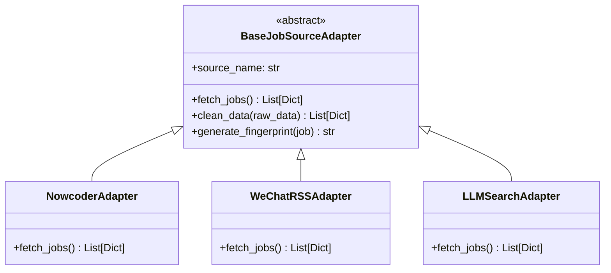

# 岗位数据多源获取及架构实现调研报告

## 1. 多大模型扩展 (Multi-LLM Integration)

在岗位数据的解析与搜索提取中，合理利用各家大模型的长文本与联网能力，能大幅提升非结构化数据的处理效率。

### 1.1 主流大模型 API 对比与整合方案

| 模型/提供商 | 核心优势 | 联网搜索能力 | 长文本处理能力 | 适用场景 |
| --- | --- | --- | --- | --- |
| **Moonshot (Kimi)** | 极佳的长文本信息精准提取，逻辑强 | 原生支持搜索与网页解析 | 8k ~ 200k+ tokens | 处理单篇超长微信推文、公司财报或长篇招聘简章的深度结构化提取。 |
| **Qwen (通义千问)** | 开源生态最好，中文指令依从性强 | 支持夸克搜索 API 插件 | 32k ~ 128k+ tokens | 批量、高并发的常规招聘文本解析，使用小模型（如 Qwen-Turbo）成本极低。 |
| **Doubao (豆包)** | 字节跳动生态，API 极其廉价且极速 | 提供内置搜索与知识库检索 | 4k ~ 128k tokens | 实时数据流处理，对海量抓取到的短文本进行快速清洗与实体识别。 |
| **Zhipu (智谱 GLM-4)**| 国内第一梯队的综合能力，工具调用稳定 | 内置 Web Search 功能强 | 128k tokens | 复杂任务规划，结合搜索自动补充公司背景、验证薪资范围等增强型任务。 |

### 1.2 通用 Search API 结合 LLM 的结构化提取
- **工作流**：使用 `Tavily` 或 `Exa.ai` (专为 LLM 优化的搜索引擎) 或 `Serper API` (Google 搜索) 提供“大厂校招”、“Java开发 招聘”等查询，获取相关网页正文片段。
- **优势**：
  - **高度结构化**：利用大模型的 JSON Mode（或 Function Calling / Structured Output 工具），可以将杂乱的网页摘要硬性转为 `{"company": "", "title": "", "location": "", "reqs": []}` 的标准 JSON 格式。
  - **实时性高**：直接抓取当下搜索引擎的新鲜数据，弥补很多招聘平台无法轻易爬取的短板。

---

## 2. 微信公众号招聘数据获取

微信公众号是很多企业首发内推、校招资讯的核心阵地，但微信生态相对封闭，数据获取需特定路径。

### 2.1 获取路径调研

1. **RSSHub 订阅**：
   - *原理*：利用 RSSHub 引擎抓取微信公众号历史文章转为 RSS 订阅流。
   - *可行性*：需自建部署以突破公共节点限制，目前获取频次有限制，适合低频订阅（如每天拉取一次特定的招聘公众号）。
2. **搜狗微信抓取**：
   - *原理*：通过搜狗搜索引擎的微信入口。
   - *可行性*：反爬极其严重（验证码拦截、Cookie 过期快），不建议作为高可用系统的首选方案。
3. **Playwright 自动化抓取 (网页版/PC端/微信读书)**：
   - *原理*：模拟真实用户登录，利用微信网页版协议或 PC 微信挂机辅助脚本抓取。
   - *可行性*：中等。实现稍微繁琐，需要定期人工干预扫码保持登录态，但数据获取最完整。
4. **聚合平台抓取 (推荐)**：
   - *原理*：爬取网易、搜狐或一些三方公众号文章聚合分发平台，这些平台通常会收录头部公众号文章，且反爬相对宽松。

### 2.2 LLM 结构化提取流程 (HR 图文解析)
1. **数据降噪**：抓取 HTML -> 转为 Markdown (去标签、样式，保留文本结构)。
2. **Prompt 工程**：构建 Few-shot 提示词，要求模型提取`公司名称`、`岗位名称`、`工作城市`、`薪酬范围`、`投递邮箱/链接`。
3. **校验落库**：对返回的 JSON 结构进行 Pydantic 数据验证，剔除缺失关键字段（如没写岗位或公司）的废数据。

---

## 3. 官方网站与招聘平台数据源

### 3.1 目标源分析
- **牛客网 (Nowcoder)**：拥有完善的校招日历与企业汇总板块。可通过逆向抓取其公开/半公开的 API，直接获取 JSON 列表。
- **海投网 (Haitou)**：宣讲会、校招信息聚合度高，部分板块支持 RSS 或结构化列表，容易编写轻量级爬虫（BeautifulSoup）。
- **各大厂官网 (腾讯、阿里、字节、华为等)**：
  - 各大厂招聘官网通常为前后端分离，在网络控制台抓包即可发现 `/api/v1/jobs` 类的接口。
  - 对于使用 React/Vue 渲染的页面，若 API 加密，可使用 **Playwright** 进行渲染后抓取。

### 3.2 现代化数据提取方案：Crawl4AI
强烈建议在处理无头浏览器抓取时引入 **Crawl4AI**，这是一款专为 LLM 设计的开源爬虫：
- 自动提取页面主要内容并输出清晰的 Markdown。
- 支持基于 LLM 的 Instruction-based 结构化数据提取。
- 极大地简化了以前 BeautifulSoup 寻找各种 `div class="xyz"` 的脆弱硬编码逻辑。

---

## 4. 架构设计与实现方案 (Python)

为了兼容多数据源及不同的抓取/解析机制，需设计一套高扩展性的**适配器架构** (Adapter Pattern)。

### 4.1 核心架构设计



### 4.2 Python 样例架构代码

```python
import hashlib
import sqlite3
from abc import ABC, abstractmethod
from typing import List, Dict

class BaseJobSourceAdapter(ABC):
    @property
    @abstractmethod
    def source_name(self) -> str:
        """数据源名称标识"""
        pass

    @abstractmethod
    def fetch_jobs(self) -> List[Dict]:
        """
        获取原始岗位数据
        必须返回包含字典的列表，字典应至少包含 company, title, location
        """
        pass

    def generate_fingerprint(self, job: Dict) -> str:
        """生成唯一指纹，用于 MD5 去重"""
        company = job.get('company', '').strip().lower()
        title = job.get('title', '').strip().lower()
        location = job.get('location', '').strip().lower()
        # 拼接指纹特征串
        unique_string = f"{company}_{title}_{location}"
        return hashlib.md5(unique_string.encode('utf-8')).hexdigest()

    def clean_data(self, raw_jobs: List[Dict]) -> List[Dict]:
        """统一数据清洗与生成唯一标识"""
        cleaned = []
        for job in raw_jobs:
            job_id = self.generate_fingerprint(job)
            job['job_id'] = job_id
            job['source'] = self.source_name
            cleaned.append(job)
        return cleaned

# 示例：牛客网适配器实现
class NowcoderAdapter(BaseJobSourceAdapter):
    @property
    def source_name(self) -> str:
        return "Nowcoder"

    def fetch_jobs(self) -> List[Dict]:
        # TODO: HTTP 请求牛客网 API，获取列表数据
        # 模拟返回
        return [
            {"company": "ByteDance", "title": "后端开发工程师", "location": "Beijing", "url": "https://..."},
            {"company": "Tencent", "title": "前端开发工程师", "location": "Shenzhen", "url": "https://..."}
        ]

# 统一调度落库逻辑
class JobPipeline:
    def __init__(self, db_path="data/jobhunter.db"):
        self.conn = sqlite3.connect(db_path)
        self._init_db()
        self.adapters = []

    def _init_db(self):
        cursor = self.conn.cursor()
        cursor.execute('''
            CREATE TABLE IF NOT EXISTS jobs (
                job_id TEXT PRIMARY KEY,
                company TEXT,
                title TEXT,
                location TEXT,
                source TEXT,
                url TEXT,
                insert_time DATETIME DEFAULT CURRENT_TIMESTAMP
            )
        ''')
        self.conn.commit()

    def register_adapter(self, adapter: BaseJobSourceAdapter):
        self.adapters.append(adapter)

    def run(self):
        for adapter in self.adapters:
            try:
                raw_data = adapter.fetch_jobs()
                cleaned_data = adapter.clean_data(raw_data)
                self.save_to_db(cleaned_data)
            except Exception as e:
                print(f"Error fetching from {adapter.source_name}: {e}")

    def save_to_db(self, jobs: List[Dict]):
        cursor = self.conn.cursor()
        for job in jobs:
            # 利用 INSERT OR IGNORE 基于主键（指纹）实现无感知去重
            cursor.execute('''
                INSERT OR IGNORE INTO jobs (job_id, company, title, location, source, url)
                VALUES (?, ?, ?, ?, ?, ?)
            ''', (job['job_id'], job.get('company'), job.get('title'), 
                  job.get('location'), job['source'], job.get('url')))
        self.conn.commit()
        print(f"Successfully processed {len(jobs)} records.")

if __name__ == "__main__":
    pipeline = JobPipeline()
    pipeline.register_adapter(NowcoderAdapter())
    pipeline.run()
```

## 5. 总结与建议

| 数据来源方案 | 实施难度 | 稳定性 | 数据覆盖度 | 推荐整合方式 |
| --- | --- | --- | --- | --- |
| 大厂官网 API 直连 | 低 | 高 | 垂直精准 | HTTP/Requests 抓包 API，编写对应 Adapter |
| 招聘平台 (牛客/海投) | 低 | 较高 | 极高 (校招为主) | 针对性请求其移动端或公开 API |
| 微信公众号图文解析 | 高 | 中等 | 广泛 (内推/一手) | RSSHub 抓流 -> 转 Markdown -> Kimi/Qwen 结构化提取 |
| 全网大模型搜索 API | 中 | 高 | 极高 (海量) | Tavily API 结合 Zhipu/GPT 的 Function Calling 返回 JSON |

**实施建议路线**：
1. **阶段一**：优先完成 `BaseJobSourceAdapter` 设计，并实现 1~2 个最简单的官网 API 接入，打通 `去重机制` 与 `SQLite 落库` 流程。
2. **阶段二**：引入 Crawl4AI 搭配开源低成本大模型（如 Qwen-Turbo 或 豆包），攻克静态平台及简单微信文章的抓取解析难题。
3. **阶段三**：整合搜索 API（如 Tavily）+ 复杂 LLM 提取管线，作为兜底的数据发掘工具。
